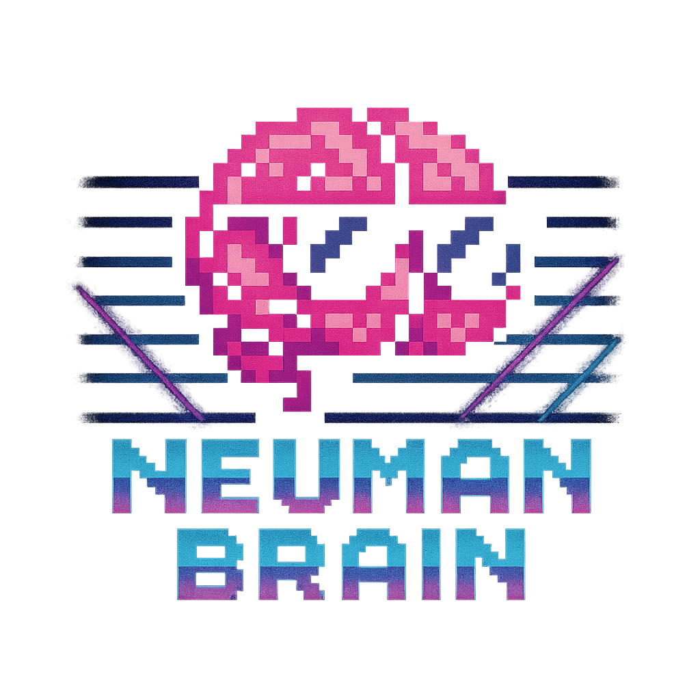
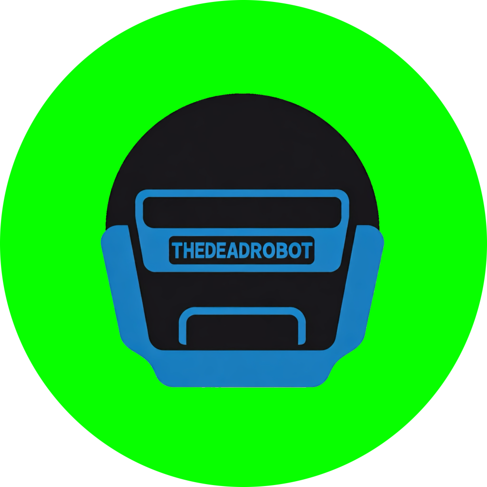
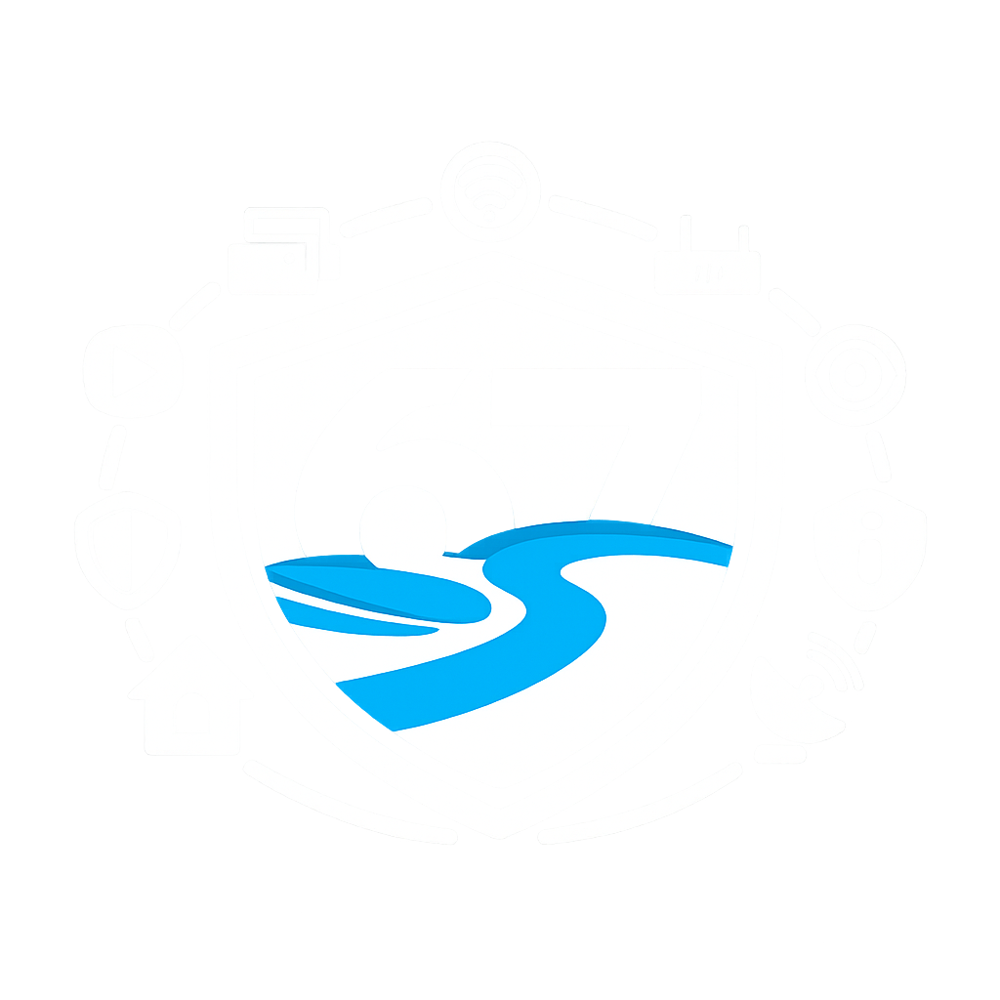

<!-- Hero Banner - Clickable to Portfolio -->

  

  
  
  

---

## Hey there! I'm Travis

I'm an I.T. Professional based in **Grand Rapids, Michigan** with 10+ years keeping enterprise systems running—and a passion for building things that live on the internet. I bridge the gap between operations and development: I understand how systems fail because I've fixed them at 3am, and I build with that experience in mind.

---

## 📚 Currently Building

- **Neuman Brain** — Privacy-first productivity suite (661 tests, 44+ widgets, 8 AI providers, zero-data-host)
- **Lazy Golfing** — Full-stack golf platform (Next.js 16 + NestJS + PostgreSQL, self-hosted on homelab)
- **thedeadrobot** — Autonomous AI content agent ($0/mo, Cloudflare Workers, 3-tier LLM fallback chain)
- **Homelab** — 55+ devices on Windows Server 2022 + Hyper-V powering self-hosted services

---

## Featured Projects

<table>
  <tr>
    <td align="center" valign="top" width="20%">
      
       
      <a href="https://brain.neuman.dev"><strong>Neuman Brain</strong></a>
       
      661 tests · 200+ features · 8 AI providers
    </td>
    <td align="center" valign="top" width="20%">
      
       
      <a href="https://lazygolfing.com"><strong>Lazy Golfing</strong></a>
       
      100% test coverage · OWASP compliant
    </td>
    <td align="center" valign="top" width="20%">
      
       
      <a href="https://thedeadrobot.com"><strong>thedeadrobot</strong></a>
       
      $0/mo · Cloudflare Workers · 3 LLM providers
    </td>
    <td align="center" valign="top" width="20%">
      
       
      <a href="https://travisjneuman.com"><strong>Homelab Infrastructure</strong></a>
       
      55+ devices · Hyper-V · Docker
    </td>
    <td align="center" valign="top" width="20%">
      
       
      <a href="https://travisjneuman.com"><strong>Fantasy Analytics</strong></a>
       
      19 seasons · 1000+ matchups · 211 data files
    </td>
  </tr>
</table>

  
    Want to learn more? Check out the <a href="https://travisjneuman.com/#projects"><strong>full project showcase</strong></a> on my website.
  

---

## Tech Stack

**Frontend**

**Backend**

**Data**

**AI/ML**

**Infrastructure**

---

  
   
  
    <a href="https://travisjneuman.com">travisjneuman.com</a> ·
    <a href="https://linkedin.com/in/travisjneuman">LinkedIn</a> ·
    <a href="mailto:travis@neuman.dev">Email</a>
  

