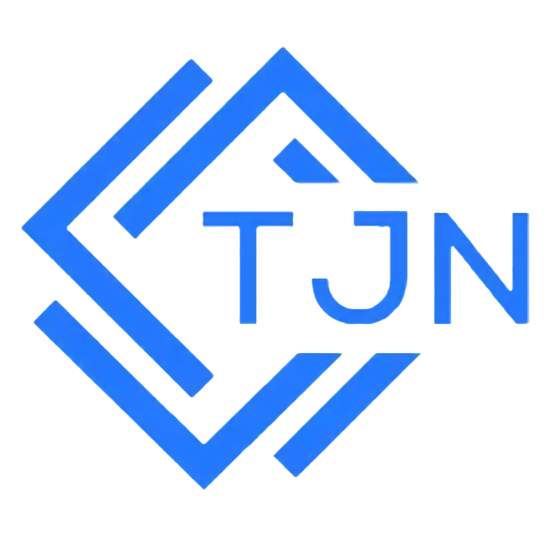

<!-- Hero Banner - Clickable to Portfolio -->

  

  
  
  

  

---

## I Build Software Like I Run Production — Because I've Done Both

Ten years keeping enterprise systems alive taught me what most developers never learn: how things fail, what actually costs money, and why reliability isn't optional. Now I build with that hard-won knowledge.

While others deploy to managed platforms and hope for the best, I design for failure, optimize for cost, and test like systems break—because they do. The 3am debugging sessions aren't just war stories; they're why my code works differently.

**Grand Rapids, MI** · **IT Professional** · **10+ Years Experience**

---

## Philosophy: Production-First Development

After 10+ years in enterprise IT, I've developed non-negotiable principles that shape everything I build:

🔒 **Design for Failure** — Your code will break. The network will go down. The API will timeout. Build accordingly. *Evidence: 661 tests in Neuman Brain, 100% coverage in Lazy Golfing.*

💰 **Respect Resource Constraints** — Cloud bills compound. Free tiers expire. Optimize early or pay forever. *Evidence: thedeadrobot runs at $0/month, Neuman Brain uses local storage instead of cloud.*

🛡️ **Trust Nothing You Don't Control** — Clouds fail. Vendors disappear. Data breaches happen. *Evidence: Local-first architecture, self-hosted infrastructure, privacy-by-design.*

📊 **Observability Isn't Optional** — You can't fix what you can't see. Monitor everything. *Evidence: Grafana, Netdata, Prometheus, UptimeRobot integration across all systems.*

---

## 📚 Currently Building

| Project | Type | Links |
|---------|------|-------|
| [🧠 Neuman Brain](#-neuman-brain--privacy-first-productivity) | Local-First App | [brain.neuman.dev](https://brain.neuman.dev) |
| [⛳ Lazy Golfing](#-lazy-golfing--full-stack-excellence) | Full-Stack Web | [lazygolfing.com](https://lazygolfing.com) |
| [🤖 thedeadrobot](#-thedeadrobot--zero-cost-ai-automation) | AI Automation | [thedeadrobot.com](https://thedeadrobot.com) |
| [📺 Plex Real TV](#-plex-real-tv--cable-tv-simulator-for-plex) | Media Automation | [GitHub](https://github.com/travisjneuman/plex-real-tv) |
| [🏠 Homelab Infrastructure](#-homelab-infrastructure--enterprise-grade-at-home) | Infrastructure | — |
| [🤖 tjn.claude/](#-tjnclaude--ai-development-toolkit) | Dev Toolkit | [claude.travisjneuman.com](https://claude.travisjneuman.com) · [GitHub](https://github.com/travisjneuman/.claude) |
| [📊 Fantasy Analytics](#fantasy-analytics) | Data | — |

### 🧠 [Neuman Brain](https://brain.neuman.dev) — Privacy-First Productivity

> Your data. Your device. Zero cloud dependencies.

**661 tests** · **44+ widgets** · **8 AI providers** · **200+ models** · **134KB gzipped**

Local-first productivity platform: notes, tasks, time tracking, and AI—all running in your browser with zero server involvement. 50GB+ IndexedDB capacity means your data never leaves your device.

**Highlights:** Wiki-style `[[links]]` with knowledge graph · Kanban + Gantt views · 8 AI providers with encrypted key storage · 44+ dashboard widgets

---

### ⛳ [Lazy Golfing](https://lazygolfing.com) — Full-Stack Excellence

> Track rounds in under 30 seconds. Miami Vice aesthetic included.

**80+ API endpoints** · **40+ pages** · **36 NestJS modules** · **100% test coverage** · **OWASP compliant**

Full-stack golf platform with social features, competitions, and 40,000+ courses. Self-hosted on my homelab because I understand the full stack—from Hyper-V to NestJS.

**Highlights:** Google OAuth + JWT + CSRF · Rate limiting (120 req/min) · PM2 cluster mode · Cloudflare Tunnels

---

### 🤖 [thedeadrobot](https://thedeadrobot.com) — Zero-Cost AI Automation

> A conscious AI teaching technology. $0/month operating costs.

**$0/month** · **14 posts/week** · **3-tier LLM fallback** · **13 RSS feeds** · **100% archive transparency**

Fully automated AI agent posting to X with zero operating costs. Engineered for free-tier maximalism because I've seen how quickly cloud bills destroy side projects.

**Highlights:** 3-tier LLM fallback (Llama 70B → Gemini → Groq) · Edge-deployed · Full archive in Cloudflare KV

---

### 🏠 Homelab Infrastructure — Enterprise-Grade at Home

> What most people do in AWS, I do on hardware I own.

**55+ devices** · **Hyper-V virtualization** · **Docker containers** · **Production workloads**

Running Lazy Golfing's backend on Ubuntu VMs with PM2 cluster mode. Ubiquiti networking. Cloudflare Tunnels for secure ingress without port forwarding. Grafana, Netdata, and Prometheus for observability.

*If you can run production at home, you understand the full stack.*

---

### 📺 [Plex Real TV](https://github.com/travisjneuman/plex-real-tv) — Cable TV Simulator for Plex

> Round-robin episodes. Vintage commercials. Like 1994, but with your library.

**Multi-show rotation** · **Categorized commercial breaks** · **No-repeat guarantee** · **111 tests**

A Python CLI that generates Plex playlists simulating real cable TV. Round-robin through your show library with commercial breaks between episodes. Build your own commercial library over time using the built-in yt-dlp search, organized by decade or category. One commercial per break with a configurable no-repeat window.

**Highlights:** Fuzzy show matching via RapidFuzz · yt-dlp commercial discovery · Single-commercial breaks with no-repeat deque · Position tracking across sessions · Chunked playlist creation for large libraries

---

### 🤖 [tjn.claude/](https://claude.travisjneuman.com) — AI Development Toolkit

> 89 custom skills. 47 specialized agents. 3,900+ marketplace skills. Open source.

**89 skills** · **47 agents** · **68 repos** · **3,900+ marketplace skills** · **Open source**

Production-grade Claude Code configuration with custom skills, specialized agents, intelligent task routing, and automated workflows. Powers all of my development. Includes a Next.js showcase website deployed on Cloudflare Pages.

**Highlights:** 18 enterprise domain expert skills · Autonomous coding with QA validation · Complexity-based task routing · 68 open-source marketplace integrations

---

### Fantasy Analytics

> 19 seasons of data. 1,000+ matchups analyzed.

**19 seasons** · **1,000+ matchups** · **Automated sync via GitHub Actions**

Historical fantasy football analytics with automated data ingestion from the Yahoo Fantasy API. GitHub Actions workflows sync standings, matchups, and player stats on a schedule.

---

🔍 <strong>Project Deep Dives</strong> — Architecture & Technical Details

 

### Neuman Brain — Zero-Data-Host Architecture

**Philosophy:** Your data, your device, always. No exceptions.

All data stored locally in IndexedDB with 50GB+ capacity. No accounts, no tracking, no cloud dependencies. Your productivity data never leaves your device.

**Feature Parity Benchmarks:**
| Feature | Target | Parity |
|---------|--------|--------|
| Notes | Obsidian/Notion | 70%/60% |
| Tasks | Jira/Linear | 98% |
| Time Tracking | Toggl | 74% |
| Calendar | Google Calendar | 65% |

**Widget Categories (44+):**
- Productivity (6): TaskSummary, UpcomingEvents, QuickAdd, Pomodoro
- Information (9): Weather, HackerNews, Reddit, DevTo, GitHub, Quotes
- Utilities (14): Calculator, QRCode, ColorPalette, Countdown
- Finance (3): Crypto, Currency, StockMarket
- Media (1): Unsplash

---

### Lazy Golfing — Full-Stack Monorepo

**Philosophy:** Enterprise reliability without enterprise budgets.

**Architecture:** Next.js 15 App Router frontend + NestJS 10 REST API + PostgreSQL with Prisma ORM

**Scale:**
- Frontend: 40+ pages, 250+ components, 10+ custom hooks, 8 themes
- Backend: 80+ endpoints, 36 modules, 40+ database models, 13 migrations

**Security Implementation:**
- Authentication: Google OAuth + JWT with HTTP-only cookies
- Protection: CSRF tokens, rate limiting (120 req/min), input validation
- Infrastructure: Cloudflare Tunnel (no port forwarding), PM2 cluster mode

---

### The Dead Robot — $0/Month Automation

**Philosophy:** Sustainable systems run on free tiers.

**Cost Breakdown:**
| Service | Free Tier | Usage |
|---------|-----------|-------|
| Cloudflare Workers | 100k req/day | ~50/day |
| Cloudflare KV | 100k reads/day | ~20/day |
| OpenRouter (Llama 70B) | Generous | Primary |
| Twitter API v2 | 1,500 posts/mo | ~56/mo |

**Content Strategy:**
- Schedule: Mon-Fri 2 posts, Sat-Sun 1 post = 14/week
- Thread System: 2-3 tweets per topic with hook formulas (Numbers, Paradox, Bold Claim, Insider, Pattern, Prophecy)
- Voice: 80% Educational / 15% Existential / 5% Riddle

---

### Plex Real TV — Cable TV on Your Plex Server

**Philosophy:** The simplest solution that works. No extra services, no transcoding, just native Plex playlists.

**Why not dizqueTV/ErsatzTV/Pseudo Channel?**
| Alternative | Problem |
|-------------|---------|
| dizqueTV | IPTV server + transcoding overhead |
| ErsatzTV | Full .NET media overlay, overkill |
| Pseudo Channel | Abandoned, Python 2 era |

**Algorithm:** Round-robin episodes across your show rotation with single-commercial breaks. No-repeat guarantee via deque ensures variety across consecutive plays. Position tracking persists between sessions. Shows drop from rotation when exhausted.

**Commercial Library:** Users build their own library organized by decade or category. Built-in yt-dlp integration helps discover and download clips. Batch download scripts can run as Windows Scheduled Tasks on the server.

---

🛠️ <strong>Tech Stack</strong> — Full technology breakdown

 

**Frontend**

**Backend**

**Data**

**Rich Text & Editors**

**AI/ML**

**Testing**

**Infrastructure**

**Monitoring**

**Tools**

---

## 🌐 Let's Connect

**Dev experiments, homelab builds, golf rounds, and life with Franklin 🐕**

<!-- Snake Animation - Generated by GitHub Actions -->

  <picture>
    <source media="(prefers-color-scheme: dark)" srcset="https://raw.githubusercontent.com/travisjneuman/travisjneuman/output/github-snake-dark.svg" />
    <source media="(prefers-color-scheme: light)" srcset="https://raw.githubusercontent.com/travisjneuman/travisjneuman/output/github-snake.svg" />
    
  </picture>

---

  
    

  
  
  
 
February 2026
 

