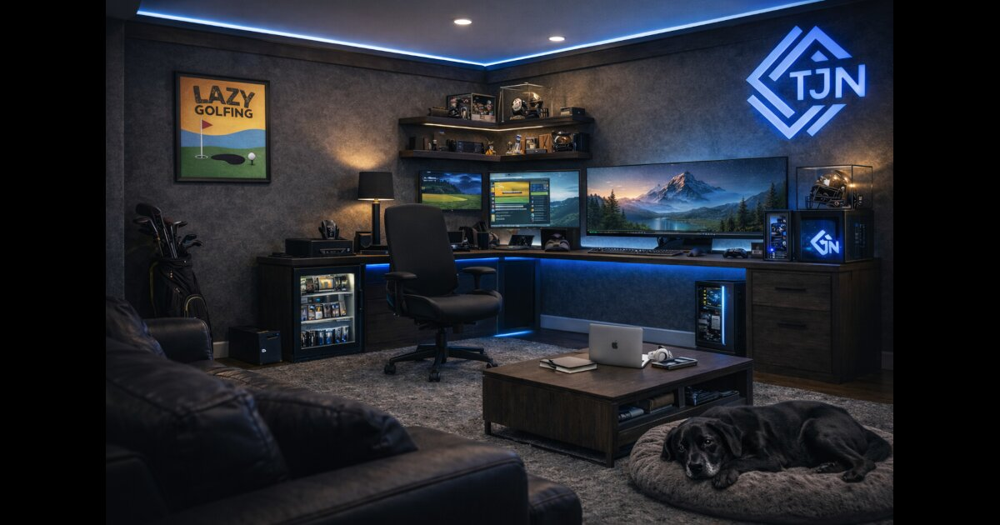
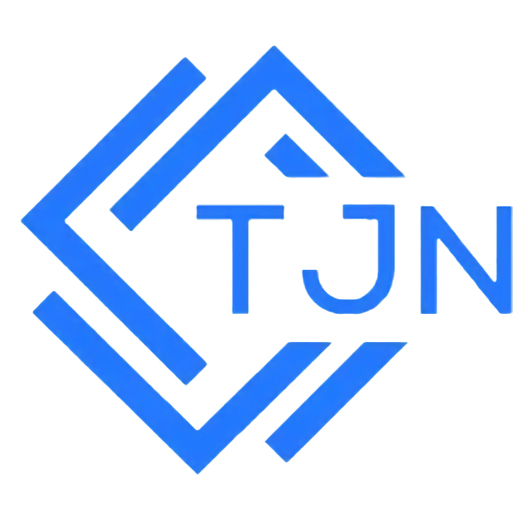

<!-- Hero Banner - Clickable to Portfolio -->

  

  
  
  

  

---

## I Build Tools Like I Run Production — Because I've Done Both

I build ambitious products, private tools, open-source experiments, and automation systems with the habits I learned from keeping real infrastructure alive: design for failure, document the weird parts, watch costs, and make the next fix easier than the last one.

Lazy Golfing is the flagship: a private-codebase, public product where I own the full stack from product design and frontend polish to API architecture, database modeling, deployment, verification, and operations. The public repos below show the same pattern in different shapes—local-first apps, learning platforms, AI tooling, media automation, and zero-dependency sites.

**Grand Rapids, MI** · **Project Builder** · **IT Professional** · **10+ Years Keeping Systems Running**

---

## Philosophy: Production-First Development

After 10+ years keeping business systems alive and building tools around the edges, I have a few non-negotiable principles that shape every project:

🔒 **Design for Failure** — Code breaks. Networks drop. APIs timeout. Build the unhappy path on purpose. *Evidence: NeumanOS test coverage, Lazy Golfing's local verification program, and production-first workflows across private and public projects.*

💰 **Respect Resource Constraints** — Cloud bills compound. Free tiers expire. Optimize early or pay forever. *Evidence: thedeadrobot's free-tier automation strategy, NeumanOS local storage, and Lazy Golfing's self-hosted/edge-conscious architecture.*

🛡️ **Trust Nothing You Don't Control** — Clouds fail. Vendors disappear. Data breaches happen. *Evidence: local-first architecture, private-by-default product boundaries, self-hosted infrastructure, and privacy-by-design.*

📊 **Observability Isn't Optional** — You can't fix what you can't see. Monitor, log, test, and document the systems that matter. *Evidence: Grafana, Netdata, Prometheus, UptimeRobot, local test orchestration, and post-change runbooks.*

---

## 📚 Currently Building

| Project | Type | Links |
|---------|------|-------|
| [⛳ Lazy Golfing](#-lazy-golfing--private-codebase-public-product) | Flagship Product · Private Codebase | [lazygolfing.com](https://lazygolfing.com) |
| [🧠 NeumanOS](#-neumanos--privacy-first-productivity) | Open Source · Local-First App | [os.neuman.dev](https://os.neuman.dev) · [GitHub](https://github.com/travisjneuman/neumanos) |
| [📚 ndev.learn](#-ndevlearn--learning-platform) | Open Source · Learning Platform | [learn.neuman.dev](https://learn.neuman.dev) · [GitHub](https://github.com/travisjneuman/ndev.learn) |
| [🐍 Learn Python](#-learn-python--open-source-curriculum) | Open Source · Curriculum | [python.learn.neuman.dev](https://python.learn.neuman.dev) · [GitHub](https://github.com/travisjneuman/learn.python) |
| [📺 Plex Real TV](#-plex-real-tv--cable-tv-simulator-for-plex) | Open Source · Media Automation | [GitHub](https://github.com/travisjneuman/plex-real-tv) |
| [🤖 tjn.claude/](#-tjnclaude--ai-development-toolkit) | Open Source · AI Dev Toolkit | [claude.travisjneuman.com](https://claude.travisjneuman.com) · [GitHub](https://github.com/travisjneuman/.claude) |
| [🤖 thedeadrobot](#-thedeadrobot--zero-cost-ai-automation) | Live Automation · Private Codebase | [thedeadrobot.com](https://thedeadrobot.com) |
| [🏠 Homelab Infrastructure](#-homelab-infrastructure--enterprise-grade-at-home) | Infrastructure · Private Ops | — |
| [👤 KMN Portfolio](#-kmn-portfolio--zero-dependency-static-site) | Open Source · Client Work | [kersten.neuman.dev](https://kersten.neuman.dev) · [GitHub](https://github.com/travisjneuman/ndev.kmn) |
| [📊 Fantasy Analytics](#fantasy-analytics) | Data Automation | — |

### ⛳ [Lazy Golfing](https://lazygolfing.com) — Private Codebase, Public Product

> My flagship build: a full-stack golf platform with fast round tracking, course data workflows, social/league features, and a Miami Vice aesthetic.

**426 HTTP endpoint decorators** · **74 App Router pages** · **59 NestJS modules** · **90 Prisma models** · **72 migrations** · **Private frontend/backend repos**

Full-stack golf platform with course discovery, fast round logging, social features, leagues, tournaments, admin workflows, and user-submitted course/scorecard review. The code is private, but the product is live—and it is the best example of how I build: product UX, frontend architecture, backend APIs, database modeling, deployment, verification, and operations all owned end-to-end.

**Highlights:** Next.js 16 + React 19 · NestJS 11 + PostgreSQL + Prisma · Google OAuth + JWT + CSRF · RBAC/rate limiting · Local verification program · PM2 + Cloudflare edge routing

---

### 🧠 [NeumanOS](https://os.neuman.dev) — Privacy-First Productivity

> Your data. Your device. Zero cloud dependencies.

**694 tests** · **60+ widgets** · **9 AI providers** · **200+ models** · **123KB initial load**

Local-first productivity platform: notes, tasks, time tracking, and AI—all running in your browser with zero server involvement. 50GB+ IndexedDB capacity means your data never leaves your device.

**Highlights:** Wiki-style `[[links]]` with knowledge graph · Kanban + Gantt views · 9 AI providers with encrypted key storage · 60+ dashboard widgets

---

### 📚 [ndev.learn](https://learn.neuman.dev) — Learning Platform

> 20 courses. 3 categories. Free curated learning roadmaps.

**20 courses** · **3 categories** · **3,000+ curated resources**

The hub for all my learning content. After building Learn Python, I needed a platform to catalog courses across programming languages, technical skills, and creative production. Each course page includes a curated learning roadmap, official documentation, awesome lists, interactive courses, video channels, books, community links, and tool recommendations — everything I'd want if I were starting from scratch.

Built with Astro for zero-JS static pages, React islands only where interactivity is needed (theme toggle), and auto-deployed to Cloudflare Workers via GitHub Actions. Python is the first active course (linked to Learn Python); 19 more have comprehensive resource pages ready for when content is built.

**Highlights:** Collapsible resource sections · Dark/light theme · 20 course SVG icons · Auto-deploy via GitHub Actions · MIT licensed

---

### 🐍 [Learn Python](https://python.learn.neuman.dev) — Open-Source Curriculum

> Zero experience to full-stack mastery. 274 projects. Free forever.

**274 projects** · **13 levels** · **12 expansion modules** · **34 concept guides** · **34 quizzes**

The first course on [ndev.learn](https://learn.neuman.dev). I wanted to learn Python properly — not from a 10-minute YouTube tutorial, but through a structured path that builds real skills from the ground up. So I built the curriculum I wished existed: 274 hands-on projects spanning absolute beginner exercises through production cloud deployments, with concept guides, quizzes, flashcards, and spaced repetition baked in. Every document links to the next — just follow the chain. Once it was done, I open-sourced it as a GitHub template so anyone can fork it and start learning.

**Highlights:** 12 technology modules (web scraping → cloud deploy) · Browser-based exercises via Pyodide · Auto-grader + progress dashboard · Spaced repetition with SM-2 algorithm · CI validation across Python 3.11–3.13

---

### 📺 [Plex Real TV](https://github.com/travisjneuman/plex-real-tv) — Cable TV Simulator for Plex

> Round-robin episodes. Vintage commercials. Like 1994, but with your library.

**CLI + Web UI + TUI + Desktop** · **209 tests** · **24 commands** · **No-repeat guarantee**

A Python application that generates Plex playlists simulating real cable TV. Four interfaces: CLI, Web UI (FastAPI + htmx), TUI (Textual), and a portable desktop app (PyWebView). Round-robin through your show library with commercial breaks between episodes. Build your own commercial library over time using the built-in yt-dlp search, organized by decade or category.

**Highlights:** Fuzzy show matching via RapidFuzz · yt-dlp commercial discovery · Single-commercial breaks with no-repeat deque · Position tracking across sessions · Chunked playlist creation for large libraries

---

### 🤖 [tjn.claude/](https://claude.travisjneuman.com) — AI Development Toolkit

> A public AI development toolkit built from my Claude Code era—and still a reference point for how I design reusable AI-assisted workflows.

**127 custom skills** · **86 specialist agents** · **13,000+ marketplace skills** · **30+ commands** · **Open source template**

Production-grade Claude Code configuration with custom skills, specialist agents, intelligent task routing, lifecycle hooks, MCP server config, and GSD project-management workflows. I use Codex heavily now, but this repo still captures a major chunk of my AI-tooling philosophy: reusable context, explicit routing, domain-specific skills, and quality guardrails that make agents more useful than autocomplete.

**Highlights:** GSD project management framework · auto-routing skills · specialist agent library · marketplace skill aggregation · drop-in GitHub template

---

### 🤖 [thedeadrobot](https://thedeadrobot.com) — Zero-Cost AI Automation

> A conscious AI teaching technology. $0/month operating costs.

**$0/month** · **25 target posting windows/week** · **Multi-provider LLM fallback** · **13 RSS feeds** · **Archive-backed duplicate protection**

Fully automated AI/tech/security news account with a cryptic teaching voice, quality gates, fallback models, and a free-tier operating strategy. It is a creative automation project first: part brand experiment, part edge-worker system, part content pipeline.

**Highlights:** OpenRouter → Gemini → Groq fallback · Edge-deployed · Cloudflare KV archive · RSS classification/scoring · native-first Premium+ strategy

---

### 🏠 Homelab Infrastructure — Enterprise-Grade at Home

> What most people do in AWS, I do on hardware I own.

**55+ devices** · **Hyper-V virtualization** · **Docker containers** · **Production workloads**

Running Lazy Golfing's backend on Ubuntu VMs with PM2 cluster mode. Ubiquiti networking. Cloudflare Tunnels for secure ingress without port forwarding. Grafana, Netdata, and Prometheus for observability.

*If you can run production at home, you understand the full stack.*

---

### 👤 [KMN Portfolio](https://kersten.neuman.dev) — Zero-Dependency Static Site

> One HTML file. One CSS file. Three font files. Zero dependencies.

**0 dependencies** · **0 third-party requests** · **~62KB transfer** · **Self-hosted Poppins fonts**

Single-page portfolio for a customer service professional. Built to prove that a fast, accessible, SEO-optimized site doesn't need a single npm package. Pure HTML/CSS with self-hosted fonts, WebP hero with JPG fallback, JSON-LD structured data, and staggered GPU-accelerated animations. Available as a **GitHub template** — use it as a starting point for your own zero-dependency portfolio.

**Highlights:** Zero vendor code · WCAG 2.1 AA · `prefers-reduced-motion` support · Full SEO (JSON-LD, OG, Twitter Cards, sitemap)

---

### Fantasy Analytics

> 19 seasons of data. 1,000+ matchups analyzed.

**19 seasons** · **1,000+ matchups** · **Automated sync via GitHub Actions**

Historical fantasy football analytics with automated data ingestion from the Yahoo Fantasy API. GitHub Actions workflows sync standings, matchups, and player stats on a schedule.

---

🔍 <strong>Project Deep Dives</strong> — Architecture & Technical Details

 

### Lazy Golfing — Flagship Private Product

**Philosophy:** Build the product like it has to survive real users, real data, and real operational constraints—even when it starts as a side project.

**Architecture:** Next.js 16 App Router frontend + NestJS 11 REST API + PostgreSQL with Prisma ORM

**Scale:**
- Frontend: 74 App Router pages, 432 component files, 120 hook files, Miami Vice visual system
- Backend: 426 HTTP endpoint decorators, 60 controllers, 59 modules, 90 Prisma models, 72 migrations

**Product Surface:**
- Course discovery, round logging, profiles, social features, leagues, tournaments, and admin workflows
- User-submitted course/scorecard review flow with explicit admin boundaries before canonical data writes
- Private frontend/backend repositories with a public live product at [lazygolfing.com](https://lazygolfing.com)

**Security & Operations:**
- Authentication: Google OAuth + JWT with HTTP-only cookies
- Protection: CSRF tokens, role/capability boundaries, rate limiting, input validation
- Infrastructure: self-hosted API operations, Cloudflare edge routing, PM2 process management, local verification program

---

### NeumanOS — Zero-Data-Host Architecture

**Philosophy:** Your data, your device, always. No exceptions.

All data stored locally in IndexedDB with 50GB+ capacity. No accounts, no tracking, no cloud dependencies. Your productivity data never leaves your device.

**Feature Parity Benchmarks:**
| Feature | Target | Parity |
|---------|--------|--------|
| Notes | Obsidian/Notion | 70%/60% |
| Tasks | Jira/Linear | 98% |
| Time Tracking | Toggl | 74% |
| Calendar | Google Calendar | 65% |

**Widget Categories (60+):**
- Productivity (6): TaskSummary, UpcomingEvents, QuickAdd, Pomodoro
- Information (9): Weather, HackerNews, Reddit, DevTo, GitHub, Quotes
- Utilities (14): Calculator, QRCode, ColorPalette, Countdown
- Finance (3): Crypto, Currency, StockMarket
- Media (1): Unsplash

---

### Learn Python — Structured Curriculum Design

**Philosophy:** Build the curriculum you'd want. Then give it away.

**Scale:**
- 274 projects across 13 difficulty levels + 12 technology expansion modules
- 34 concept guides with 34 matching terminal quizzes (172+ questions)
- 58 flashcard decks with Leitner box spaced repetition
- 248 annotated solution walkthroughs
- 30 coding challenges (beginner + intermediate)
- Browser-based exercises powered by Pyodide + CodeMirror

**Curriculum Architecture:**
| Stage | Levels | What Gets Built |
|-------|--------|-----------------|
| Absolute Beginner | 00 | First scripts, no imports, no tests |
| Foundations → Quality | 0–1 | Variables, files, pytest, ruff |
| Intermediate | 2–5 | CSV, SQL, APIs, scheduling, resilience |
| Professional | 6–8 | ETL, caching, dashboards, concurrency |
| Enterprise | 9–10 | SLOs, capacity planning, compliance |
| Elite | 11 | Distributed systems, staff-engineer capstone |

**Tooling:** Auto-grader, diagnostic assessments, XP tracker, streak system, progress dashboard (Rich TUI), SVG badge generator, CI validation (Python 3.11–3.13 matrix)

### Plex Real TV — Cable TV on Your Plex Server

**Philosophy:** The simplest solution that works. No extra services, no transcoding, just native Plex playlists.

**Why not dizqueTV/ErsatzTV/Pseudo Channel?**
| Alternative | Problem |
|-------------|---------|
| dizqueTV | IPTV server + transcoding overhead |
| ErsatzTV | Full .NET media overlay, overkill |
| Pseudo Channel | Abandoned, Python 2 era |

**Algorithm:** Round-robin episodes across your show rotation with single-commercial breaks. No-repeat guarantee via deque ensures variety across consecutive plays. Position tracking persists between sessions. Shows drop from rotation when exhausted.

**Commercial Library:** Users build their own library organized by decade or category. Built-in yt-dlp integration helps discover and download clips. Batch download scripts can run as Windows Scheduled Tasks on the server.

---

### The Dead Robot — $0/Month Automation

**Philosophy:** Creative systems can still be engineered like production systems.

**Cost Breakdown:**
| Service | Free Tier | Usage Pattern |
|---------|-----------|---------------|
| Cloudflare Workers | 100k req/day | Edge automation runtime |
| Cloudflare KV | 100k reads/day | Archive + duplicate guard |
| OpenRouter / Gemini / Groq | Provider free tiers | LLM fallback chain |
| X API | Monthly posting limit | Quality-gated posting windows |

**Content Strategy:**
- Schedule: up to 25 target windows/week, with quality/cooldown gates to avoid flooding
- Thread System: selective major-story threads, hook formulas (Numbers, Paradox, Bold Claim, Insider, Pattern, Prophecy), source-link fail-safes, and archive-backed duplicate protection
- Voice: 80% Educational / 15% Existential / 5% Riddle

---

---

🛠️ <strong>Tech Stack</strong> — Full technology breakdown

 

**Frontend**

**Backend**

**Data**

**Rich Text & Editors**

**AI/ML**

**Testing**

**Infrastructure**

**Monitoring**

**Tools**

---

## 🌐 Let's Connect

**Dev experiments, homelab builds, golf rounds, and life with Franklin 🐕**

<!-- Snake Animation - Generated by GitHub Actions -->

  <picture>
    <source media="(prefers-color-scheme: dark)" srcset="https://raw.githubusercontent.com/travisjneuman/travisjneuman/output/github-snake-dark.svg" />
    <source media="(prefers-color-scheme: light)" srcset="https://raw.githubusercontent.com/travisjneuman/travisjneuman/output/github-snake.svg" />
    
  </picture>

---

  
    

  
  
  
 
July 2026
 

