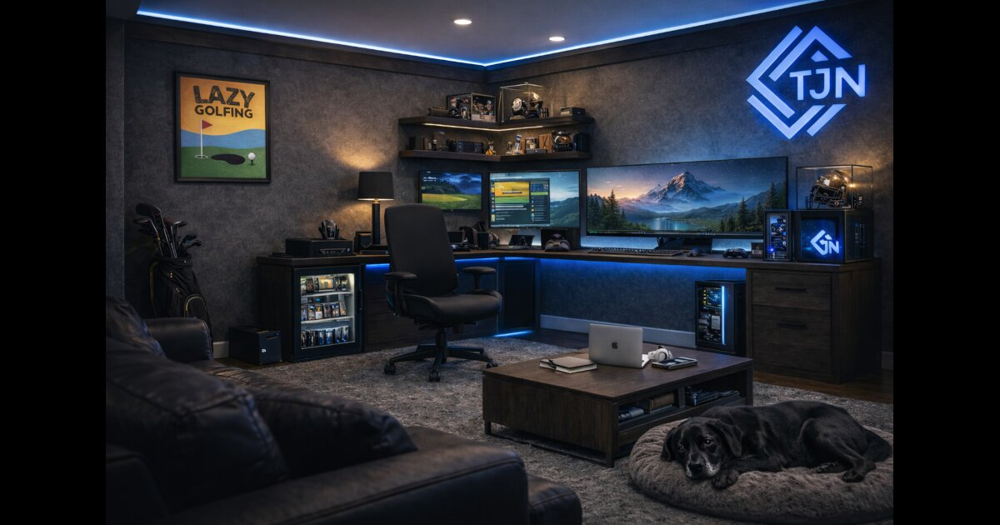
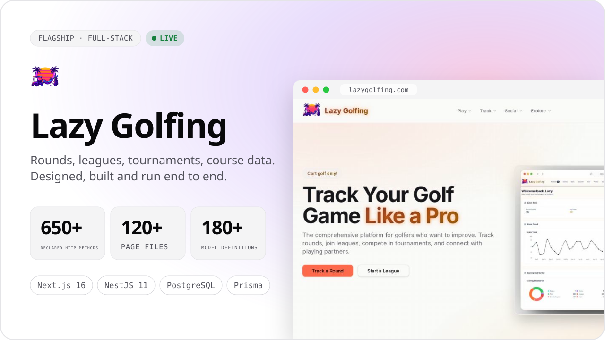
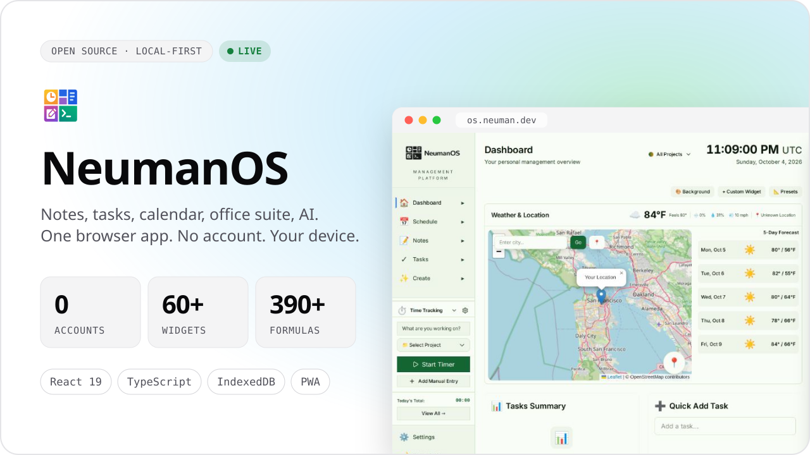
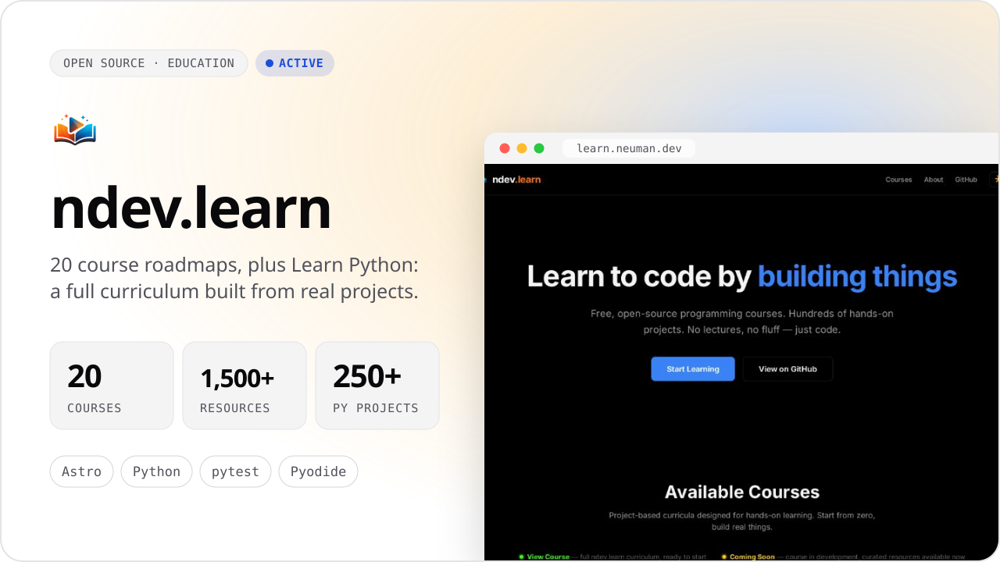
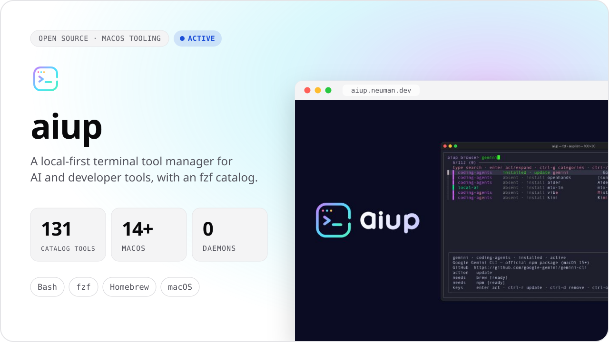
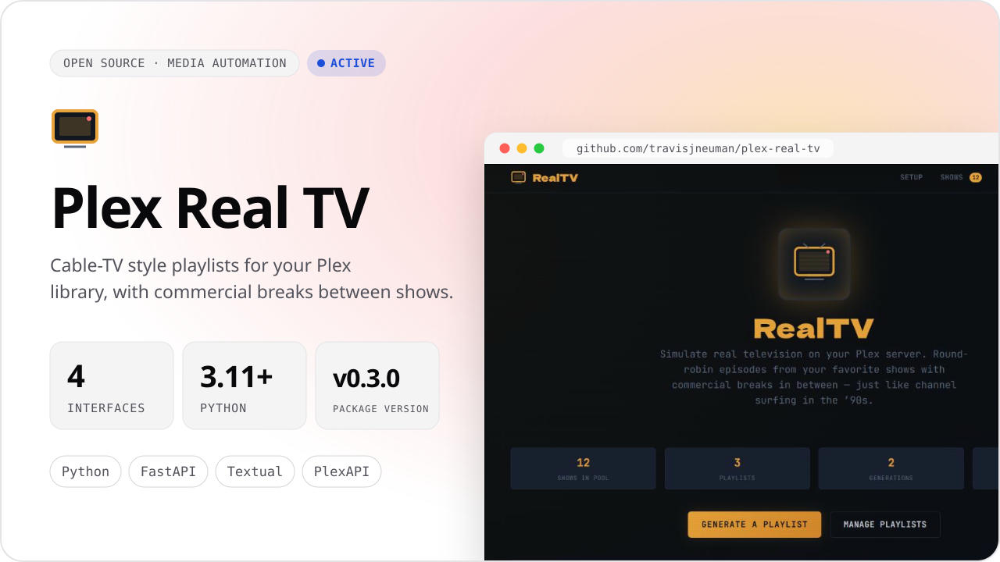
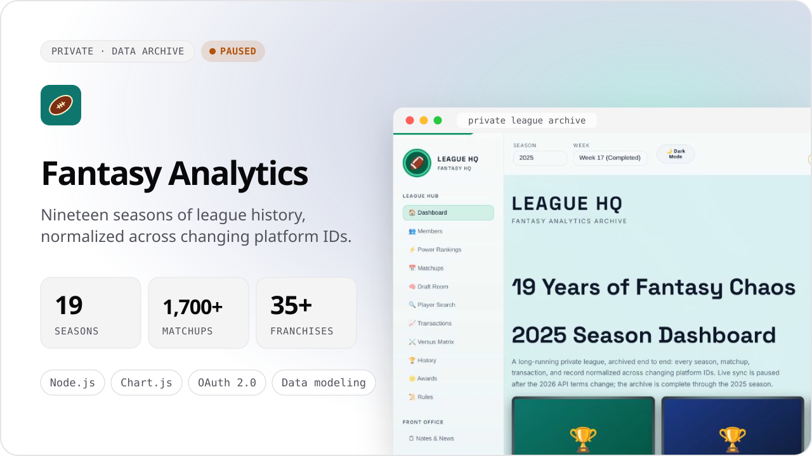
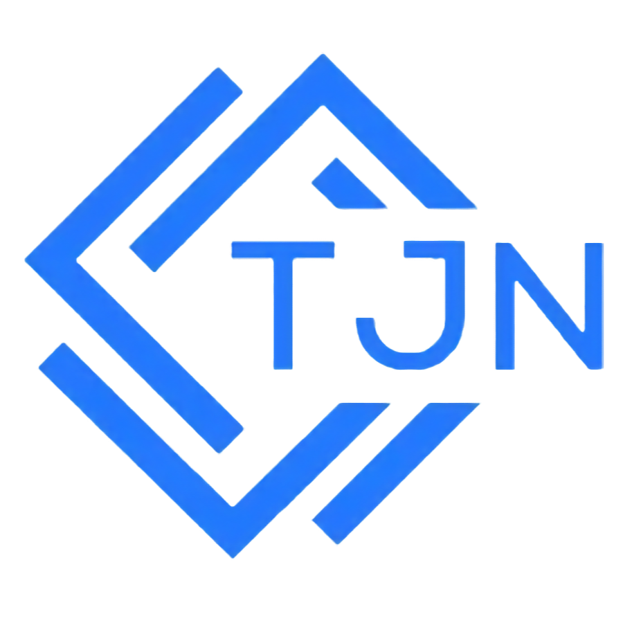

<!-- Hero Banner - Clickable to Portfolio -->

  

  
  
  

  

---

## Hi, I'm Travis

I'm a systems engineer in Grand Rapids, Michigan. I've worked in IT for 15+ years, full-time since 2015. I started as the POS programmer and sysadmin for a restaurant group, became its IT manager as it grew to 20+ locations, and now I'm a technical project manager on a managed services team that supports 100+ customer sites in warehouse automation. I was also selected for my company's AI Catalyst program, where I help teammates put the approved AI tools to practical use.

Outside of work I build things I actually use. The biggest is [Lazy Golfing](https://lazygolfing.com), a golf app I designed, built, and run myself. Most of the rest is open source and listed below.

A few habits from IT carry into everything I build:

- **Plan for things to break.** Networks drop and APIs time out, so I build the failure path on purpose.
- **Watch the bill.** Free tiers end and cloud costs add up, so I keep things lean from the start.
- **Keep data close.** Local-first where it makes sense, and nothing important depends on a vendor I can't replace.
- **If I can't see it, I can't fix it.** Monitoring, logs, and runbooks are part of the project from day one.

More about my work and a few case studies: [travisjneuman.com](https://travisjneuman.com)

---

## Projects

<!-- showcase:cards:start (generated by scripts/showcase/sync-showcase.mjs) -->
<table>
  <tr>
    <td width="50%">
      <a href="#lazy-golfing"><picture>
        <source media="(prefers-color-scheme: dark)" srcset="./assets/cards/lazy-golfing-dark.svg">
        
      </picture></a>
    </td>
    <td width="50%">
      <a href="#neumanos"><picture>
        <source media="(prefers-color-scheme: dark)" srcset="./assets/cards/neumanos-dark.svg">
        
      </picture></a>
    </td>
  </tr>
  <tr>
    <td width="50%">
      <a href="#ndevlearn"><picture>
        <source media="(prefers-color-scheme: dark)" srcset="./assets/cards/learning-dark.svg">
        
      </picture></a>
    </td>
    <td width="50%">
      <a href="#aiup"><picture>
        <source media="(prefers-color-scheme: dark)" srcset="./assets/cards/aiup-dark.svg">
        
      </picture></a>
    </td>
  </tr>
  <tr>
    <td width="50%">
      <a href="#plex-real-tv"><picture>
        <source media="(prefers-color-scheme: dark)" srcset="./assets/cards/plex-real-tv-dark.svg">
        
      </picture></a>
    </td>
    <td width="50%">
      <a href="#fantasy-analytics"><picture>
        <source media="(prefers-color-scheme: dark)" srcset="./assets/cards/fantasy-analytics-dark.svg">
        
      </picture></a>
    </td>
  </tr>
</table>
<!-- showcase:cards:end -->

<!-- showcase:table:start (generated by scripts/showcase/sync-showcase.mjs) -->
| Project | Status | What it is | Links |
|---------|--------|---------------|-------|
| [Lazy Golfing](#lazy-golfing) | Live · Private code | My main project: a golf app for rounds, courses, leagues, and tournaments that I designed, built, and run. | [lazygolfing.com](https://lazygolfing.com) · [Case study](https://travisjneuman.com/projects/lazy-golfing/) |
| [NeumanOS](#neumanos) | Live · Open source | Notes, tasks, calendar, dashboards, and optional AI in one browser app, with your data kept on your device. | [os.neuman.dev](https://os.neuman.dev) · [GitHub](https://github.com/travisjneuman/neumanos) |
| [ndev.learn](#ndevlearn) / [Learn Python](#learn-python) | Active · Open source | A learning hub with 20 course roadmaps, plus a full Python course built from 250+ projects. | [learn.neuman.dev](https://learn.neuman.dev) · [python.learn.neuman.dev](https://python.learn.neuman.dev) · [GitHub](https://github.com/travisjneuman/ndev.learn) / [GitHub](https://github.com/travisjneuman/learn.python) |
| [Plex Real TV](#plex-real-tv) | Active · Open source | Cable-TV style Plex playlists with commercial breaks, from a CLI, web UI, terminal UI, or desktop app. | [GitHub](https://github.com/travisjneuman/plex-real-tv) |
| [macOS Screenshot Pipeline](#macos-screenshot-pipeline) | Active · Open source | Screenshots land in Photos as originals and on the clipboard as real PNGs, with one-key markup in Preview. | [GitHub](https://github.com/travisjneuman/macos-screenshot-pipeline) |
| [aiup](#aiup) | Active · Open source | A terminal tool manager for AI and developer tools on macOS, with a reviewed catalog and an fzf browser. | [aiup.neuman.dev](https://aiup.neuman.dev) · [GitHub](https://github.com/travisjneuman/aiup) |
| [ndev.t3code](#ndevt3code) | In development · Open source | My T3 Code fork that adds ChatGPT as a built-in desktop surface. | [Fork](https://github.com/travisjneuman/t3code) · [Original T3 Code](https://github.com/pingdotgg/t3code) |
| [tjn.claude/](#tjnclaude) | Maintained · Open source | My Claude Code setup of skills, agents, and guardrails. I mostly use Codex now; this stays up as a reference. | [claude.travisjneuman.com](https://claude.travisjneuman.com) · [GitHub](https://github.com/travisjneuman/.claude) |
| [thedeadrobot](#thedeadrobot) | Live (Auto-posting paused) · Private code | An AI news bot that ran on free tiers for $0 a month until X's API pricing change ended free posting. | [thedeadrobot.com](https://thedeadrobot.com) · [Case study](https://travisjneuman.com/projects/thedeadrobot/) |
| [Homelab](#homelab) | Active · Private | Hardware I own, run like production: virtualization, networking, monitoring, and backups. |  |
| [KMN Portfolio](#kmn-portfolio) | Live · Open source | A one-page portfolio with zero dependencies: one HTML file, one CSS file, self-hosted fonts. | [kersten.neuman.dev](https://kersten.neuman.dev) · [GitHub](https://github.com/travisjneuman/ndev.kmn) |
| [Fantasy Analytics](#fantasy-analytics) | Paused (Archive through 2025) · Private | 19 seasons and 1,800+ matchups of league history, kept stable across changing platform IDs. | [Case study](https://travisjneuman.com/projects/fantasy-sports-analytics/) |
<!-- showcase:table:end -->

---

### [Lazy Golfing](https://lazygolfing.com)

My main project. It started as a CSV-driven site for my own golf group and grew into a full product: round logging, course search, LazyCap, groups, leagues, tournaments, and an admin side for reviewing user-submitted courses. I designed, built, and run all of it, from the UI and the API to the database, deploys, monitoring, and support. The code is private; the product is live.

**600+ API endpoints · 100+ app pages · 60+ API modules · 150+ data models · 120+ migrations**

Next.js 16 and React 19 on the front, NestJS 11 with PostgreSQL and Prisma behind it, Google sign-in with JWT cookies, CSRF protection, role checks, and rate limits. Read the [case study](https://travisjneuman.com/projects/lazy-golfing/).

---

### [NeumanOS](https://os.neuman.dev)

Notes, tasks, calendar, time tracking, dashboards, and an AI terminal in one browser app. There's no account and no server holding your data: it all lives in IndexedDB on your device and works offline. AI providers, live-data widgets, and backups are optional and only talk to outside services when you turn them on.

**No account · 60+ widgets · 390+ Excel-compatible formulas · 9 optional AI providers (keys encrypted with AES-256-GCM)**

Wiki-style `[[links]]` with a knowledge graph, Kanban and Gantt views, and dashboard widgets for everything from Pomodoro timers to stock prices. [GitHub](https://github.com/travisjneuman/neumanos)

---

### [ndev.learn](https://learn.neuman.dev)

After building Learn Python I wanted one place for courses in other subjects. ndev.learn has 20 course pages across programming, technical skills, and creative production, each with a learning roadmap and hand-picked docs, courses, videos, books, and communities. Python is the first full course; the rest are roadmaps that can grow into full courses.

**20 courses · 3 categories · 1,500+ curated links** · [GitHub](https://github.com/travisjneuman/ndev.learn)

---

### [Learn Python](https://python.learn.neuman.dev)

I wanted to learn Python properly, through a path that builds real skills, so I wrote the course I wished existed and open-sourced it. It runs from a first terminal command to deployed apps: 250+ hands-on projects across 13 levels and 12 modules (web scraping, CLIs, APIs, FastAPI, async, databases, data analysis, testing, Docker, Django, packaging, and cloud deploys). It also has concept guides, quizzes, flashcards with spaced repetition, browser exercises, and an auto-grader.

**250+ projects · 13 levels · 12 modules · 34 concept guides** · [GitHub](https://github.com/travisjneuman/learn.python) (also a GitHub template)

---

### [Plex Real TV](https://github.com/travisjneuman/plex-real-tv)

Makes a Plex library feel like cable TV. It builds playlists that rotate through your shows in order, drops a commercial between episodes, and remembers where you left off. You can build your own commercial library by decade or category with the built-in yt-dlp search. It runs four ways on the same core: CLI, web UI, terminal UI, and a portable desktop app.

I built it because the alternatives were heavier than the job: dizqueTV runs an IPTV server with transcoding, ErsatzTV is a full media overlay, and Pseudo Channel was abandoned. This one just writes native Plex playlists.

---

### [macOS Screenshot Pipeline](https://github.com/travisjneuman/macos-screenshot-pipeline)

Picks up where Cmd+Shift+3/4/5 stops. The original screenshot goes into Photos, a real PNG goes onto the clipboard, and Cmd+Shift+E opens it in Preview for markup. A launchd WatchPaths job does the work as soon as a file lands, so nothing polls in the background, and staging is cleaned up only after everything succeeds. No telemetry, no network calls. [v0.1.0 release](https://github.com/travisjneuman/macos-screenshot-pipeline/releases/tag/v0.1.0)

---

### [aiup](https://aiup.neuman.dev)

A terminal tool manager for the AI and developer tools on my Mac. It scans what's installed, keeps a reviewed catalog of 131 tools, and lets you browse it with fzf. Nothing installs, updates, or gets removed without a review step, and the inventory never leaves your machine. The launcher checks that the runtime and catalog match before switching versions and keeps the last one for recovery. [GitHub](https://github.com/travisjneuman/aiup)

---

### [ndev.t3code](https://github.com/travisjneuman/t3code)

My fork of [T3 Code](https://github.com/pingdotgg/t3code), the open-source app for driving coding agents. It adds ChatGPT as a built-in desktop surface with a persistent session, controlled navigation, explicit downloads, and its own update and data storage so it doesn't collide with the upstream app. Keeping a big fork in sync with upstream is most of the work. Still in development.

---

### [tjn.claude/](https://claude.travisjneuman.com)

The Claude Code setup I built and published: 180 custom skills, 10 specialist agents, 29 commands, routing, and hooks with safety checks, plus an index of 11,000+ marketplace skills. I use Codex for most agent work now, but this is still how I think about giving AI tools good context and guardrails. [GitHub](https://github.com/travisjneuman/.claude) · [Use as a template](https://github.com/travisjneuman/.claude/generate)

---

### [thedeadrobot](https://thedeadrobot.com)

An automated AI and tech news account with a cryptic persona. It read 13 RSS feeds, scored stories, drafted posts through OpenRouter with Gemini and Groq as fallbacks, checked every draft for quality and duplicates, and posted in set windows. It ran entirely on free tiers for $0 a month until X's API pricing change ended free posting. The site is still up; auto-posting is paused. [Case study](https://travisjneuman.com/projects/thedeadrobot/)

---

### Homelab

Hardware I own, run the way I'd run it at work: Windows Server with Hyper-V for VMs, Linux for DNS and app hosting, Ubiquiti networking, Docker for self-hosted tools, plus backups, dashboards, and uptime monitoring. It's where I practice the parts below the apps.

---

### [KMN Portfolio](https://kersten.neuman.dev)

A one-page portfolio I built for my sister. One HTML file, one CSS file, self-hosted fonts, and zero dependencies or third-party requests. It still has structured data, social cards, reduced-motion support, and accessible markup. [GitHub](https://github.com/travisjneuman/ndev.kmn) · [Use as a template](https://github.com/travisjneuman/ndev.kmn/generate)

---

### Fantasy Analytics

19 seasons of a private fantasy league's history, through 2025. Fantasy platforms change team IDs every year, so the archive maps every season back to stable franchise identities and powers rankings, head-to-head records, and awards across 1,800+ matchups. Live sync is paused after Yahoo's 2026 API terms change. League and member names stay private. [Case study](https://travisjneuman.com/projects/fantasy-sports-analytics/)

---

<strong>Tech stack and toolbelt</strong> (languages, frameworks, infrastructure, AI tools)

 

Everything here shows up in something I've shipped, run, or maintained. Each tool appears once.

  

<h3>Languages, Runtimes & Foundations</h3>

 

<h3>Frontend, UI Systems & Product Surfaces</h3>

<strong>Core</strong> 

 
<strong>UI & Motion</strong> 

 
<strong>State, Data Viz & Canvas</strong> 

 

<h3>Backend, APIs & Automation</h3>

<strong>APIs & Services</strong> 

 
<strong>Python Tools</strong> 

 
<strong>Patterns & Helpers</strong> 

 

<h3>Data, Storage & Documents</h3>

<strong>Storage</strong> 

 
<strong>Formats & Exports</strong> 

 

<h3>Rich Text, Editors & Generated Content</h3>

<strong>Editors</strong> 

 
<strong>Docs & Rendering</strong> 

 

<h3>AI, Agents & Model Providers</h3>

<strong>AI Providers</strong> 

 

<h3>Testing, Quality & Security</h3>

<strong>Test Suites</strong> 

 
<strong>Quality & Safety</strong> 

 

<h3>Infrastructure, Hosting & Operations</h3>

<strong>Hosting & Delivery</strong> 

 
<strong>Ops & Homelab</strong> 

 

<h3>Monitoring, Analytics & Observability</h3>

 

<h3>Daily Tools, IDEs & Workflow</h3>

<strong>AI Coding & Research</strong> 

 
<strong>Build & Workflow</strong> 

---

## Elsewhere

**Dev experiments, homelab builds, golf rounds, and life with Franklin 🐕**

<!-- Snake Animation - Generated by GitHub Actions -->

  <picture>
    <source media="(prefers-color-scheme: dark)" srcset="https://raw.githubusercontent.com/travisjneuman/travisjneuman/output/github-snake-dark.svg" />
    <source media="(prefers-color-scheme: light)" srcset="https://raw.githubusercontent.com/travisjneuman/travisjneuman/output/github-snake.svg" />
    
  </picture>

---

  
    

  
  
  

